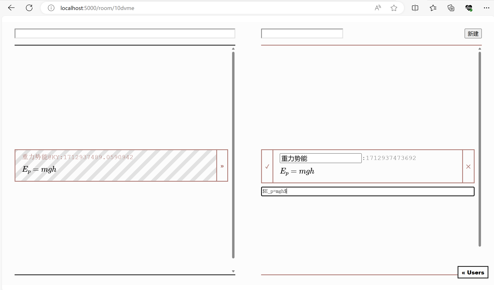

# 「敲黑板」

💕 来自 “一袋好牙”队

[@git.tsinghua](https://git.tsinghua.edu.cn/a-bag-of-awesome-teeth/blackboard)

---

我们小组的创作是「敲黑板」，一个实时公式分享软件。

## 起因

大一的时候，阿肖和阿黄在数学课上花了不少功夫，他俩经常讨论题目。两个人都喜欢用markdown记笔记、写作业，于是他们经常把自己做的题目、记的公式发来发去。

但是用微信分享<mark>公式</mark>不是很舒服。如果截图，没法把别人的过程放到自己笔记里，也没法修改。如果发latex，必须复制到自己的文档里才能看到公式长什么样。所以只好两个都发。

**这可真是麻烦🥲**……

于是大二寒假，二人决定写一个小工具解决这个问题。

## 使用说明

使用「敲黑板」分享公式需要三步：

1. 创建一个房间
2. 把房间url发送给朋友
3. 新建公式，开始编辑！

### 创建房间

房间是公式分享的基本单位。进入房间的所有人都能共享、编辑公式。

填写完房间名字、你在房间中使用的用户名以后，就可以进入房间了。

### 邀请好友

进入房间后，只要把当前房间的url发送给你的朋友，就可以邀请他进入此房间了。

填写完用户名以后，他也能进入房间。此时，点击右下角的User，你应该能在右下角看到他的用户名。

### 共享公式

填入公式名称，点击新建按钮，就能新建公式。

在公式下方的输入框里输入markdown+latex格式的公式与说明，就可以实时看到内容渲染后的效果。编辑完成后，使用左侧的箭头提交，或者使用右侧的叉删除这条公式。

同时，你可以看到其他人正在编辑，以及已经编辑完成的公式。点击任意一个公共区公式右侧的箭头，可以把它复制一份自己编辑。

使用公共区上方的搜索栏，可以对公式进行模糊搜索。这对于编辑一个特定的公式很有帮助！

## 创意说明

### 来源

该项目最像的应用是[Overleaf](https://www.overleaf.com)，一个在线实时LaTeX编辑器。但该应用需要登录才能使用，且体量过大。我们希望找到一个更轻松的分享公式的方法。

从用户体验上来看，我们更希望搭建一个像[PasteBin](https://pastebin.com)，或者[MathB](https://mathb.in)的应用，作为一个半匿名分享公式的平台。但是，类似平台都不支持实时同步编辑的功能。

我们的工具可以说是二者的结合。

### 技术栈

本项目使用的技术栈如下。

- 前端：Alpine.js
- 后端：python, flask
- 数据存储：sqlite, plain files

小组两位同学阿黄、阿肖分别负责前后端工作。
